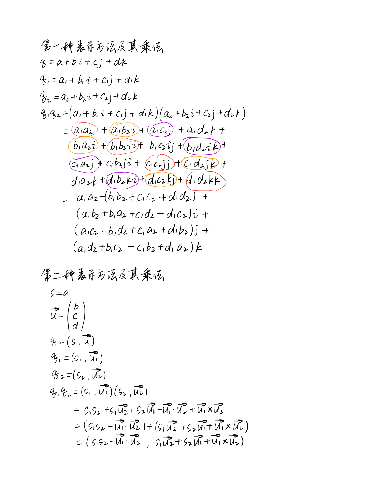
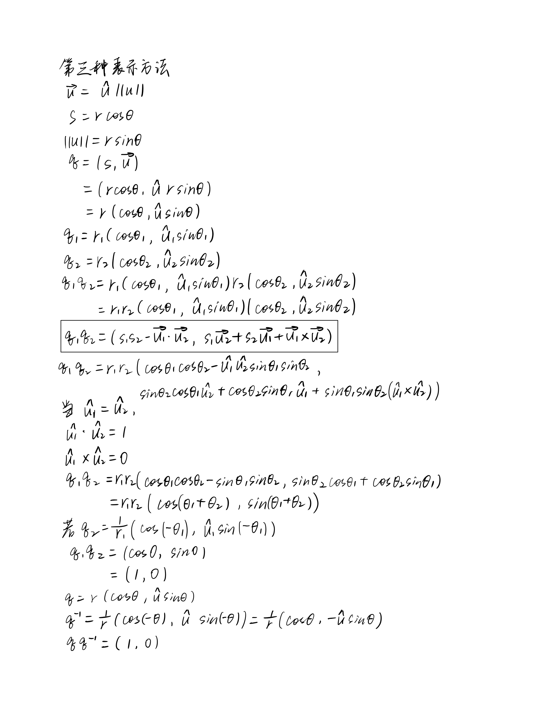
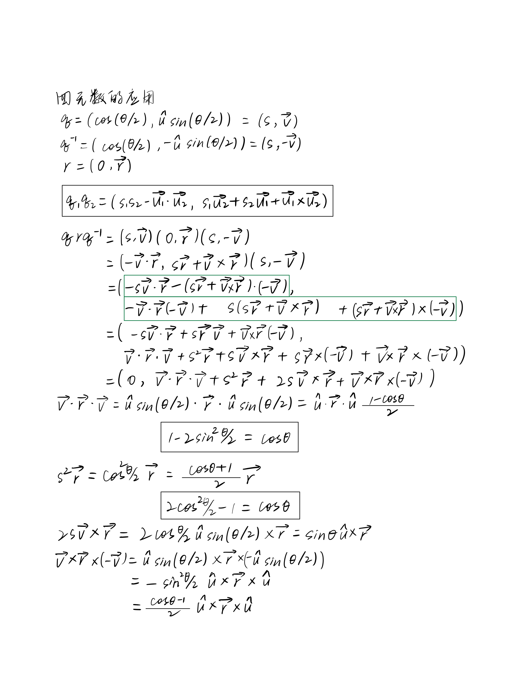
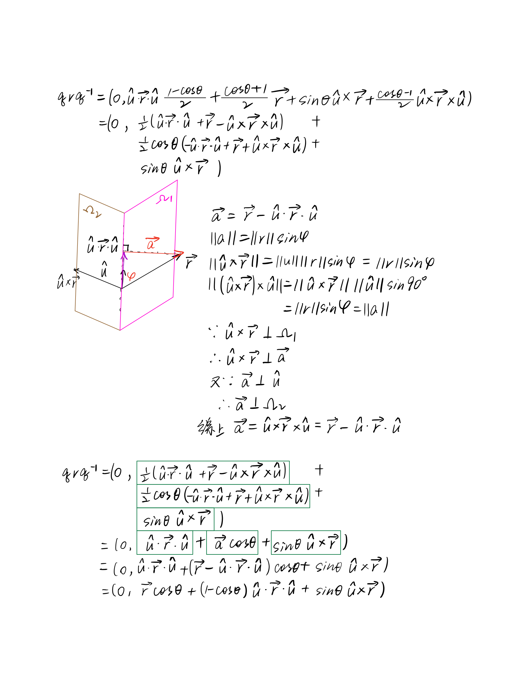
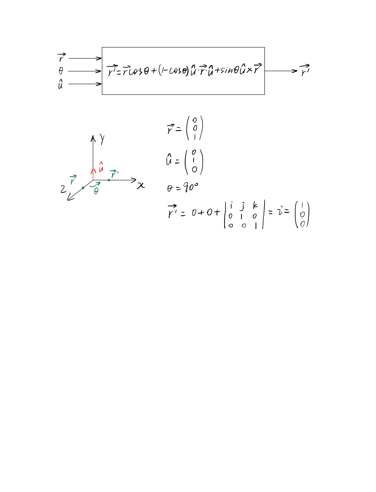

# Quaternion 四元数

[3D Rotation Converter (andre-gaschler.com)](https://www.andre-gaschler.com/rotationconverter/)

| *directory* |                |
| ----------- | -------------- |
| *cpp*       | 四元数旋转     |
| *cs*        | 欧拉角转四元数 |
| *java*      | 点绕点旋转     |
| *src*       | 四元数图片     |

