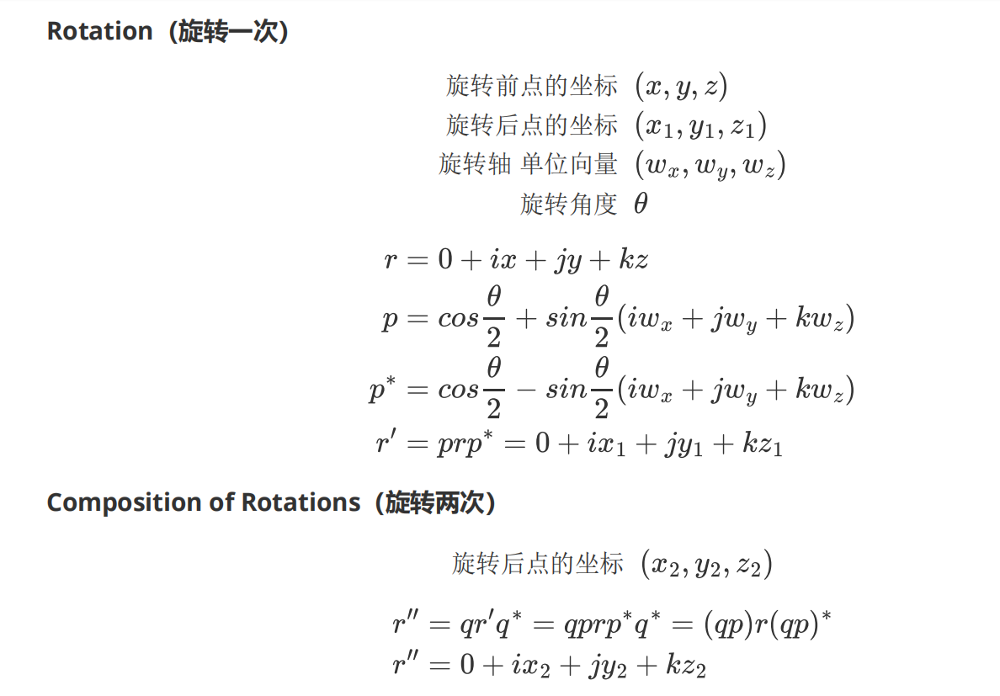

# 四元数 JAVA
| *directory* |                                  |
| ----------- | -------------------------------- |
| *primary*   | Vector3 & Quaternion             |
| *gjk2d*     | 2D GJK Algorithm                 |
| *rotate*    | One point rotates around another |

*旋转确定角度正负号：左手坐标系用左手定则 右手坐标系用右手定则*
